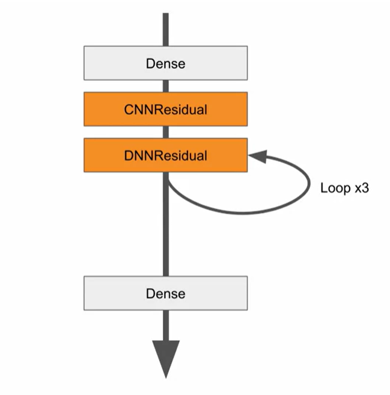
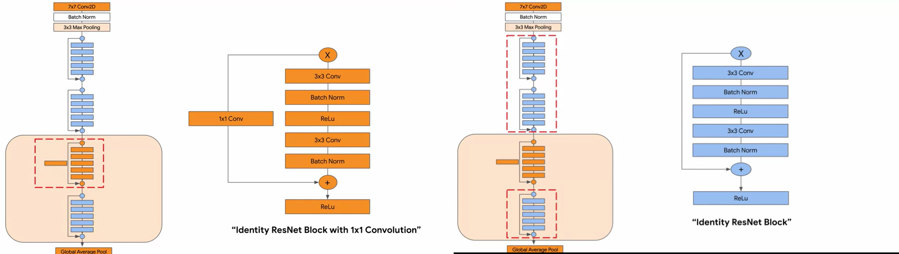

## Coding a Wide and Deep Model

```python

class WideAndDeepModel(Model):
    def __init__(self,units=30,activation='relu',**kwargs):
        super().__init__(**kwargs)
        self.hidden1 = Dense(units,activation=activation)
        self.hidden2 = Dense(units,activation=activation)
        self.main_output = Dense(1)
        self.aux_output = Dense(1)

    def call(self,inputs):
        input_A , input_B = inputs
        hidden1 = self.hidden1(input_B)
        hidden2 = self.hidden2(hidden1)
        concat = concentrate([input_A, hidden2])
        main_output = self.main_output(concat)
        aux_output = self.aux_output(hidden2)
        return main_output , aux_output  

```
```python 
model = WideAndDeepModel()  

``` 

* It is very difficult to implement dynamic and recursive networks using functional or sequential APIs.


## Residual Networks (ResNets)



#### Building a convolutional residual network
```python

class CNNResidual(Layer):
     def __init__(self, layers , filters , **kwargs):
        super().__init__(**kwargs)
        self.hidden = [Conv2D(filters , (3,3),activation="relu") for _ in range(layers)]

      def call(self,inputs):
        x= inputs
        for layer in self.hidden:
            x=layer(x)
        return inputs+x

```  
#### Building a dense residual network
```python

class DenseResidual(Layer):
     def __init__(self, layers ,neurons , **kwargs):
        super().__init__(**kwargs)
        self.hidden = [Dense(neurons ,activation="relu") for _ in range(layers)]

      def call(self,inputs):
        x= inputs
        for layer in self.hidden:
            x=layer(x)
        return inputs+x

```  
### building the model using the both CNN residual and Dense Residual

```python
class MyResidual(Model):
    def __init__(self,**kwargs):
        self.hidden1 = Dense(10,activation="relu")
        self.block1 = CNNResidual(2,32)
        self.block2 = DenseResidual(2,64)
        self.out = Dense(1)

    def call(self,inputs):
        x=self.hidden1(inputs)
        x=self.block1(x)
        for _ in range(1,4): 
            x=self.block2(x)
        return self.out(x)        
```


## Building a Residual network with the Model Class



Say the block mentioned should be repeated 3 times

```python

class Blue_Block(Model):
    def __init__(self,filters,kernal_size):
        super(Blue_Block,self).__init__(name='')

        self.conv1 = tf.keras.layers.Conv2D(filters,kernal_size,padding='same')
        self.bn1 = tf.keras.layers.BatchNormalization()

        self.conv2 = tf.keras.layers.Conv2D(filters,kernal_size,padding='same')
        self.bn2 = tf.keras.layers.BatchNormalization()

        self.act = tf.keras.layers.Activation('relu')
        self.add = tf.keras.layers.Add()

    def call(self,input_tensor):
        x=self.conv1(input_tensor)
        x=self.bn1(x)
        x=self.act(x)

        x= self.conv2(x)
        x=self.bn2(x)
        x=self.act(x)

        x= self.add([x,input_tensor])
        return x
```

```python
class Orange_Block(Blue_Block):
    def __init__(self,filters,kernel_size):
        super(Orange_Block,self).__init__(filters,kernel_size)
        self.conv3 = tf.keras.layers.Conv2D(filters,kernel_size,padding='same')

    def call(self,input_tensor):
        x=self.conv1(input_tensor)
        x=self.bn1(x)
        x=self.act(x)

        x= self.conv2(x)
        x=self.bn2(x)
        x=self.act(x)
        
        y=self.conv3(input_tensor)
        x= self.add([x,y])
        return x     

```
```python
class ResNet(tf.keras.Model):
    def __init__(self,num_classes):
        super(ResNet,self).__init__()
        self.conv = tf.keras.layers.Conv2D(64,7,padding='same')
        self.bn = tf.keras.layers.BatchNormalization()
        self.act = tf.keras.layers.Activation('relu')
        self.max_pool = tf.keras.layers.MaxPool2D((3,3))
        self.block1 = Blue_Block(64,3)
        self.block2 = Blue_Block(64,3)
        self.block3 = Orange_Block(64,3)
        self.block4 = Blue_Block(64,3)
        self.global_pool = tf.keras.layers.GlobalAveragePooling2D()
        self.classifier = tf.keras.layers.Dense(num_classes,activation='softmax')

    
    def call(self,inputs):
        x=self.conv(inputs)
        x=self.bn(x)
        x=self.act(x)
        x=self.max_pool(x)

        x=self.block1(x)
        x=self.block2(x)
        x=self.block3(x)
        x=self.block4(x)

        x=self.global_pool(x)
        return self.classifier(x)

```
#### Using the code

```python
resnet=ResNet(10)
resnet.compile(optimizer='adam',loss='sparse_categorical_crossentropy',metrics=['accuracy'])
dataset = tfds.load('mnist',split=tfds.Split.TRAIN)
dataset = dataset.map(preprocess).batch(32)
resnet.fit(dataset,epochs=1)
```


